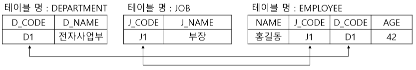

# 개요

### ㅇData

관찰 결과로 나타난 정량적 혹은 정성적인 실제 값

### 정보

데이터를 기반으로 의미를 부여한 것


에베레스트의 높이 : 8848m =  **Data** 

에베레스트는 세계에서 가장 높은 산이다. = **정보**


### Database

한 조직에 필요한 정보를 여러 응용 시스템에서 공용할 수 있도록 논리적으로 연관된 데이터를 모으고 중복되는 데이터를 최소화하여 구조적으로 통합/저장해놓은 것

#### 정의

1. **공용 데이터\(Shared Data\)** : 공동으로 사용되는 데이터
2. **통합 데이터\(Integrated Data\)** : 중복 최소화로 중복으로 인한 데이터 불일치 현상 제거
3. **저장 데이터\(Stored Data\)** : 컴퓨터 저장장치에 저장된 데이터
4. **운영 데이터\(Operational Data\)** : 조직의 목적을 위해 사용되는 데이터

#### 특징

* **실시간 접근성\(real time accessibility\)** : 사용자가 데이터 요청 시 실시간으로 결과 서비스
* **계속적인 변화\(continuos change\)** : 데이터 값은 시간에 따라 항상 바뀜
* **동시 공유\(concurrent sharing\)** : 서로 다른 업무 또는 여러 사용자에게 동시 공유됨 

###  DBMS \(DataBase Management System\)

DB에서 데이터 추출, 조작, 정의, 제어 등을 할수있게 해주는 DB 전용 관리 프로그램

| 기능 |  |
| :---: | :--- |
| 데이터 추출 \(Retrieval\) | 사용자가 조회하는 데이터 혹은 응용 프로그램의 데이터 추출 |
| 데이터 조작 \(Manipulation\) | 데이터를 조작하는 소프트웨어\(응용 프로그램\)가 요청하는 데이터 삽입, 수정, 삭제 작업 지원 |
| 데이터 정의 \(Definition\) | 데이터의 구조를 정의하고 데이터 구조에 대한 삭제 및 변경 기능 수행 |
| 데이터 제어 \(Control\) | 데이터베이스 사용자를 생성하고 모니터링하며 접근 제어 백업과 회복, 동시성 제어 등의 기능 지원 |

저는 MySQL은 사용할수 있으니, 이번에는 Oracle DB에 대하여 알아볼게요~

#### 관계형 데이터베이스

모든 데이터를 2차원 테이블 형태로 표현하고 테이블 사이의 비즈니스적 관계를 도출하는 구조 데이터의 중복을 최소화 할수있으며 업무 변화에 대한 적응력 우수

